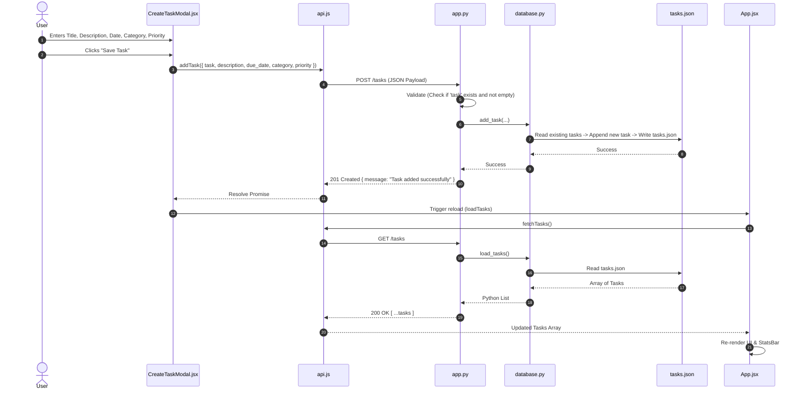

# 🏛️ System Architecture & Technical Specifications (`architecture.md`)

This document details the architectural layout, data flow, component hierarchies, API contracts, and storage model of the **PyTask (TaskFlow)** application.

---

## 1. High-Level System Architecture

The application adopts a **Decoupled Client-Server Architecture**:

```mermaid
graph TD
    subgraph Client ["Client Layer (Browser)"]
        ReactApp["React 19 SPA (Vite + Tailwind CSS)"]
        UIComponents["Components: Header, StatsBar, TaskInput, FilterBar, TaskList, TaskItem, CreateTaskModal, EditModal"]
        APIService["api.js (Centralized HTTP Client)"]
    end

    subgraph Proxy ["Development Proxy Layer"]
        ViteProxy["Vite Dev Server Proxy (Port 5173)\n/tasks -> http://127.0.0.1:5000/tasks"]
    end

    subgraph Backend ["Server Layer (Python Flask)"]
        FlaskServer["Flask WSGI Application (Backend/app.py - Port 5000)"]
        RouteHandlers["Routes: GET, POST, PUT, DELETE /tasks"]
        DataController["Database Controller (Backend/database.py)"]
    end

    subgraph Storage ["Persistence Layer"]
        JSONStore[("tasks.json File")]
    end

    UIComponents --> APIService
    APIService -->|HTTP Requests| ViteProxy
    ViteProxy -->|Proxied Requests| FlaskServer
    FlaskServer --> RouteHandlers
    RouteHandlers --> DataController
    DataController -->|Read / Write (Atomic)| JSONStore
```

---

## 2. Component Hierarchy (React Frontend)

```
App.jsx (Root State & Orchestrator)
├── Header.jsx (Brand Title, Live Status Indicator, "+ Create Task" Button)
├── StatsBar.jsx (Summary Cards: Total, Done, Pending & Animated Progress Bar)
├── TaskInput.jsx (Quick-add single-line input bar)
├── FilterBar.jsx
│   ├── SearchInput (Live text matching against title, description, category)
│   └── FilterTabs (Pill buttons: All, Active, Completed with dynamic badges)
├── TaskList.jsx (Container for task cards, handles loading & empty states)
│   └── TaskItem.jsx (Task Card: Checkbox, Title, Badges, Notes Drawer, Edit, Delete)
├── CreateTaskModal.jsx (Stitch Design: Modal form for rich task creation)
└── EditModal.jsx (Modal dialog for updating existing tasks)
```

---

## 3. Data Flow & Sequence Diagram

### 3.1 Task Creation Lifecycle



---

## 4. REST API Contract & Specifications

All API routes communicate exclusively over JSON with standard HTTP status codes:

| Endpoint | Method | Headers | Request Body | Success Response | Error Responses |
|---|---|---|---|---|---|
| `/tasks` | `GET` | — | None | `200 OK`<br>`[{ "task": "...", ... }]` | `500 Internal Server Error` |
| `/tasks` | `POST` | `Content-Type: application/json` | `{ "task": string, "description"?: string, "due_date"?: string, "category"?: string, "priority"?: string }` | `201 Created`<br>`{ "message": "Task added successfully" }` | `400 Bad Request`<br>`{ "error": "Task is required" }` |
| `/tasks/<index>/complete` | `PUT` | — | None | `200 OK`<br>`{ "message": "Task completed successfully" }` | `404 Not Found` |
| `/tasks/<index>` | `PUT` | `Content-Type: application/json` | `{ "task": string, "description"?: string, "due_date"?: string, "category"?: string, "priority"?: string }` | `200 OK`<br>`{ "message": "Task updated successfully" }` | `400 Bad Request`<br>`404 Not Found` |
| `/tasks/<index>` | `DELETE` | — | None | `200 OK`<br>`{ "message": "Task deleted successfully" }` | `404 Not Found` |

---

## 5. Data Model (`tasks.json` Schema)

Each task record adheres to the following JSON structure:

```json
[
  {
    "task": "Optimize database queries",
    "description": "Add indexes to foreign key columns and cache frequent queries.",
    "due_date": "2026-08-30",
    "category": "Work",
    "priority": "High",
    "completed": false
  }
]
```

### Field Definitions:
- **`task`** *(string, required)*: The primary task headline/title.
- **`description`** *(string, optional, default: `""`)*: Detailed notes or instructions.
- **`due_date`** *(string, optional, default: `""`)*: Target completion date in `YYYY-MM-DD` or `DD-MM-YYYY`.
- **`category`** *(string, optional, default: `"Work"`)*: Logical category (`Work`, `Personal`, `Study`, `Project`, `Health`, `Finance`).
- **`priority`** *(string, optional, default: `"Low"`)*: Urgency level (`Low`, `Medium`, `High`).
- **`completed`** *(boolean, required, default: `false`)*: State flag.
