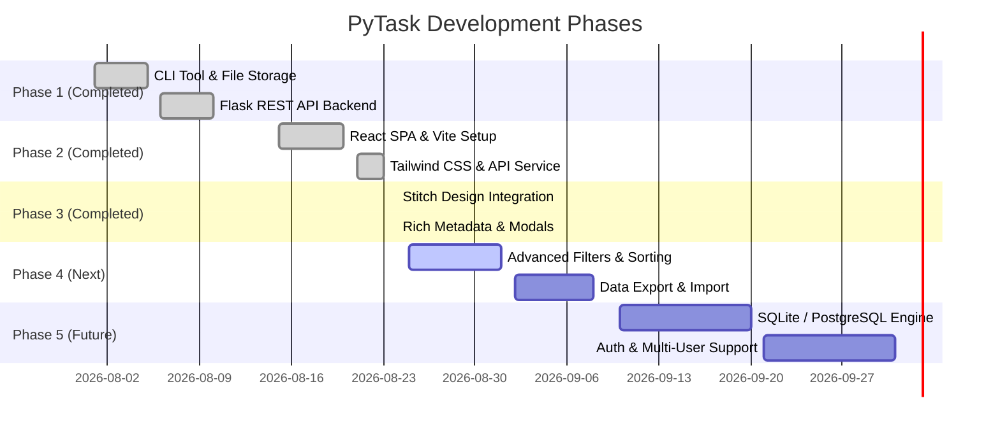

# 🗺️ Project Phases & Roadmap (`phases.doc.md`)

This document outlines the evolutionary milestones, completed deliverables, and future roadmap for the **PyTask (TaskFlow)** application.

---

## 📌 Milestone Overview

---

## ✅ Phase 1: Foundation & Backend (Completed)
- [x] **CLI To-Do Tool (`todo.py`)**: Terminal-based interactive menu with task addition, completion, editing, searching, and deletion.
- [x] **JSON Storage Engine (`database.py`)**: Robust JSON read/write handler with automatic file creation and error handling.
- [x] **Flask REST API (`app.py`)**:
  - `GET /tasks`
  - `POST /tasks`
  - `PUT /tasks/<index>/complete`
  - `PUT /tasks/<index>`
  - `DELETE /tasks/<index>`
- [x] **Initial Template View**: Basic Jinja template (`index.html`) in `Backend/templates/`.

---

## ✅ Phase 2: Modern Frontend & React Decoupling (Completed)
- [x] **React 19 + Vite Scaffolding**: Structured project setup under `frontend/`.
- [x] **Tailwind CSS v4 & Lucide Icons**: Modern dark-theme typography (Inter font) and iconography.
- [x] **Centralized API Service (`src/api.js`)**: Encapsulated HTTP request handlers.
- [x] **Vite Dev Server Proxy**: Zero-CORS development proxy forwarding `/tasks` to `http://127.0.0.1:5000`.
- [x] **Dashboard State & Live Progress**:
  - `StatsBar.jsx` with completion percentage and counters.
  - `FilterBar.jsx` with instant real-time search and status tabs.
  - Toast notification system for user feedback.

---

## ✅ Phase 3: Stitch Design System Integration (Completed)
- [x] **Stitch Screen Integration (`c0a7f56645064495b73b635a5ed0457d`)**:
  - `CreateTaskModal.jsx` matching the Stitch design specifications.
  - PyTask header badge, clean input boxes, and custom maroon `#782522` button.
- [x] **Rich Task Attributes**:
  - `TASK_TITLE`: Primary task description.
  - `DESCRIPTION`: Detailed multi-line notes.
  - `DUE_DATE`: Date picker integration.
  - `CATEGORY`: Dropdown (*Work, Personal, Study, Project, Health, Finance*).
  - `PRIORITY_LEVEL`: Selectable pill buttons (🟢 Low, 🟡 Medium, 🔴 High).
- [x] **Enhanced Task Cards (`TaskItem.jsx`)**:
  - Priority badge with colored status dots.
  - Category tag with folder icon.
  - Due date tag with calendar icon.
  - Expandable "View Notes / Hide Notes" drawer.
- [x] **Backend Support**: Extended `app.py` and `database.py` to persist rich attributes with backward compatibility.

---

## 🚀 Phase 4: Advanced Productivity & Enhancements (In Progress / Next)
- [ ] **Sorting Controls**:
  - Sort by Due Date (Earliest / Latest).
  - Sort by Priority (High to Low / Low to High).
  - Sort Alphabetically (A-Z / Z-A).
- [ ] **Category Filtering Tabs**:
  - Filter tasks by specific category pills (*Work, Personal, Study, etc.*).
- [ ] **Data Export & Backup**:
  - Export tasks to JSON / CSV file.
  - Import tasks from JSON backup.
- [ ] **Keyboard Shortcuts**:
  - `Ctrl + N` / `Cmd + N` to open the Create Task modal.
  - `Esc` to close any active modal.
  - `/` to focus the search bar immediately.

---

## 🔮 Phase 5: Production Readiness & Enterprise Features (Future)
- [ ] **Database Migration**:
  - Optional SQLite / PostgreSQL database layer via SQLAlchemy or Tortoise ORM.
- [ ] **User Authentication**:
  - User signup/login with JWT token authentication.
  - Multi-tenant data segregation.
- [ ] **Docker Containerization**:
  - Multi-stage `Dockerfile` building both React assets and Python Flask server into a single lightweight production container.
